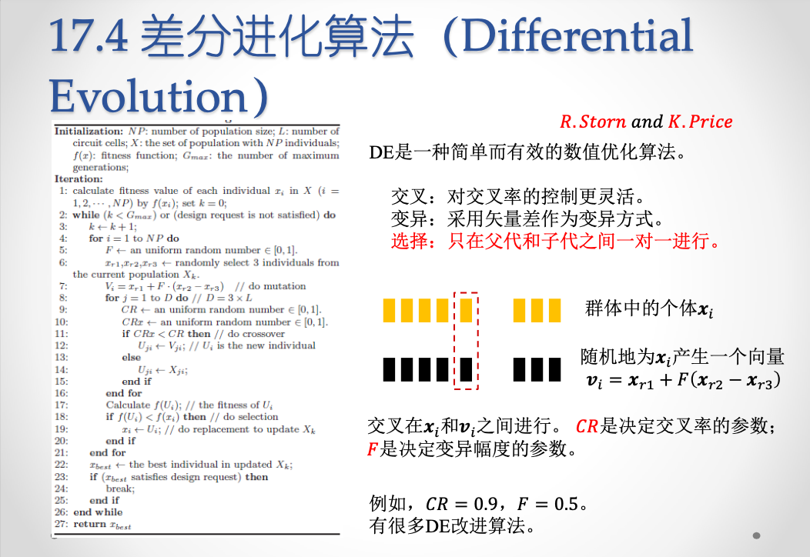
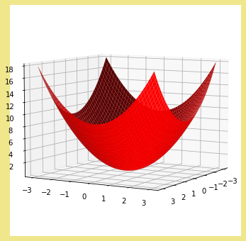
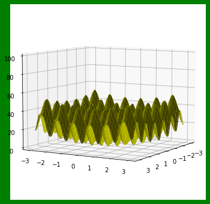
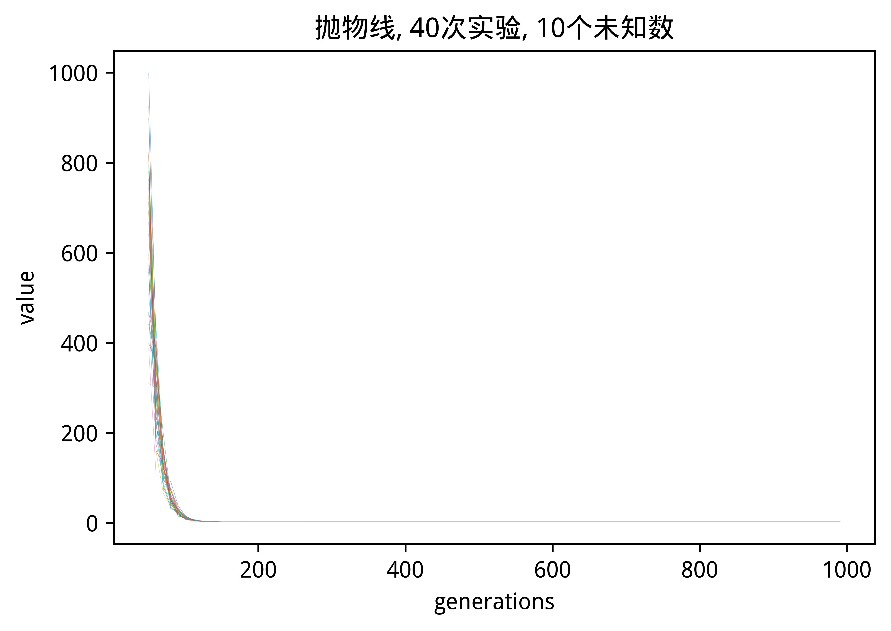
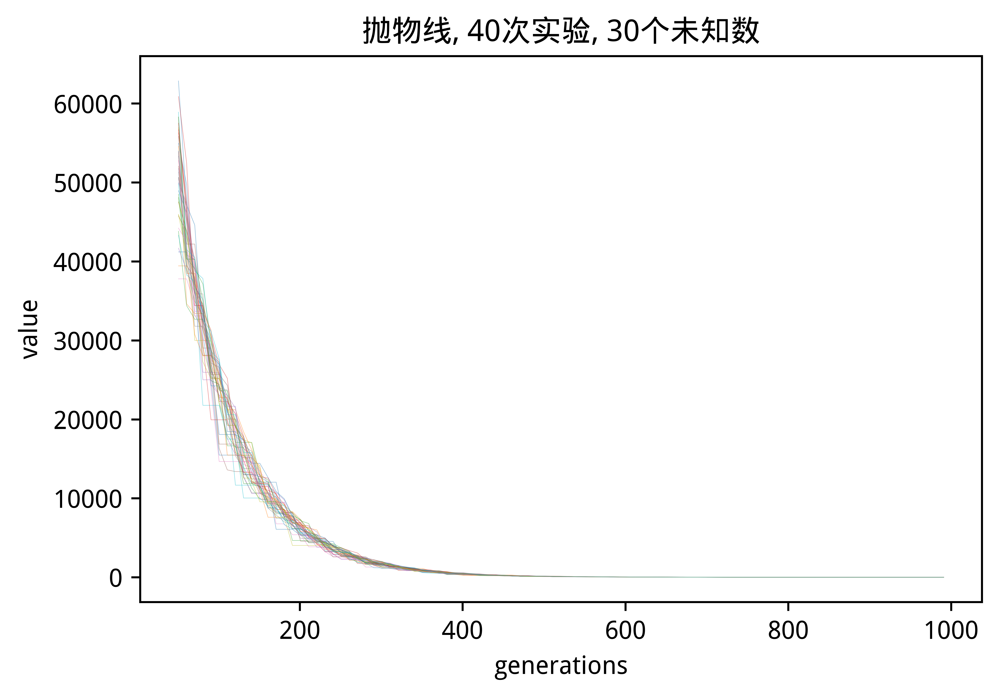
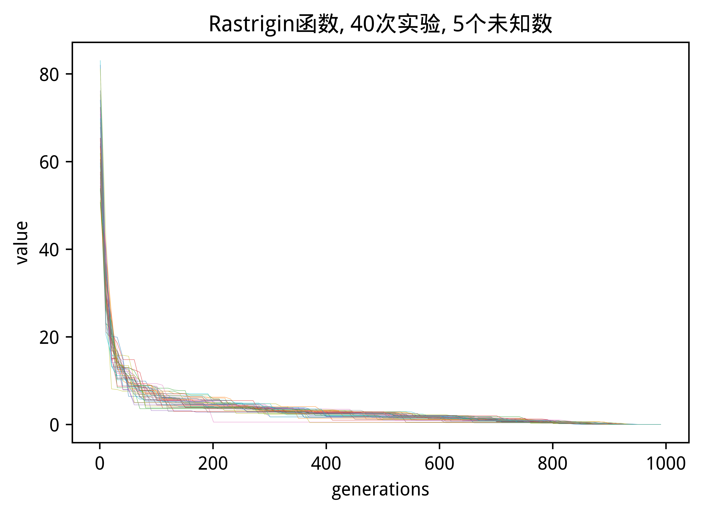
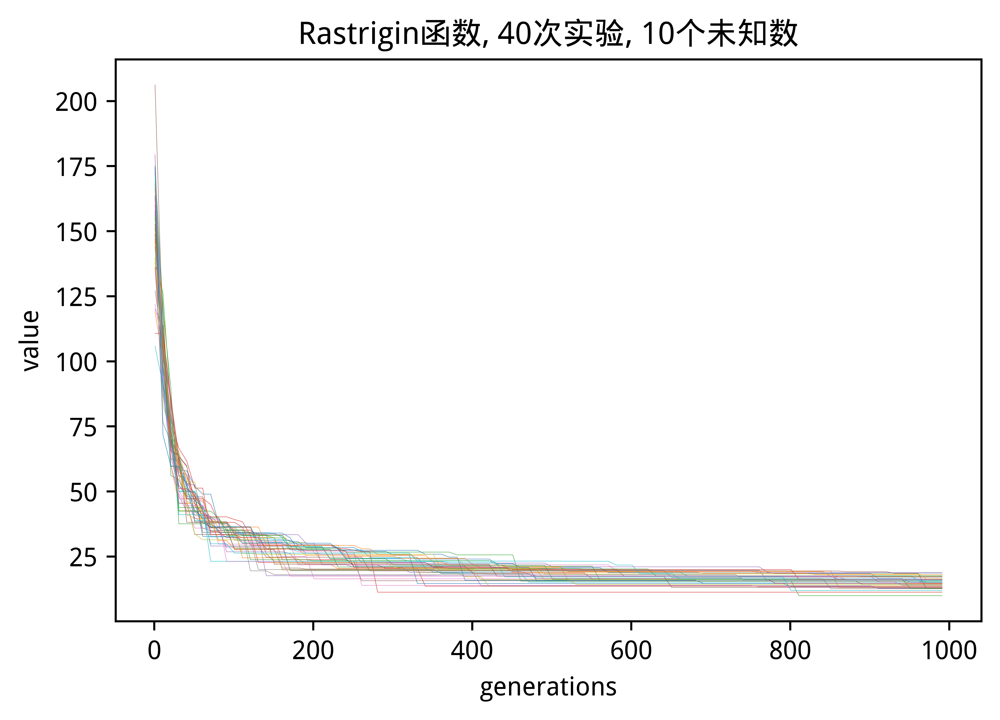
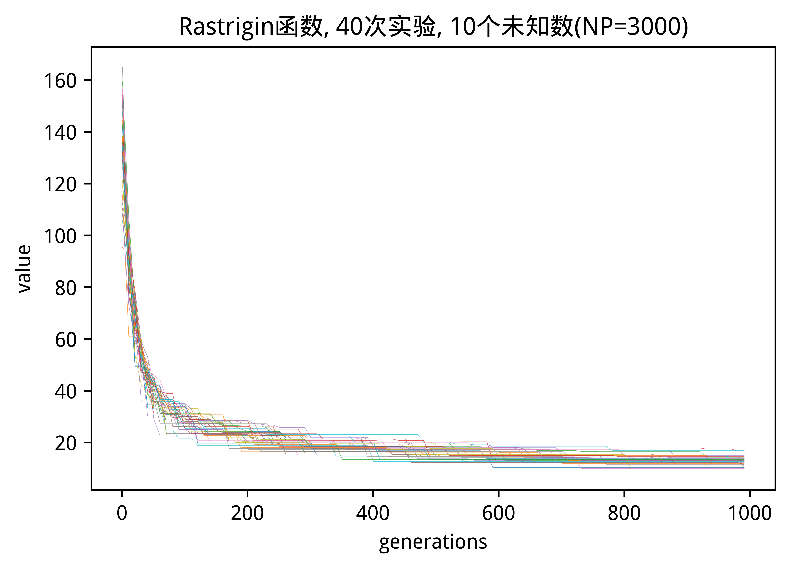
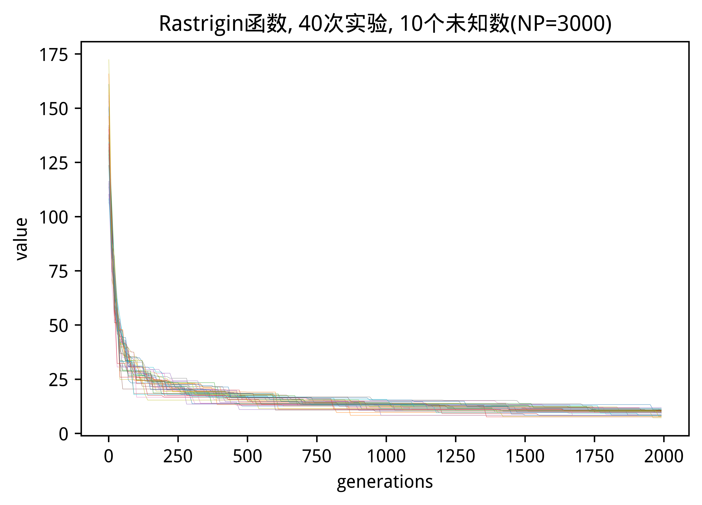

DE算法代码托管到：<https://git.ustc.edu.cn/vicking/differential-evolution>  

[TOC]
# 1. 差分进化算法(DE)的原理简介
**差分进化**算法(**Differential Evolution**)是**遗传算法**的一种。  
本实验将DE算法做成算法库提供给别的程序使用。


# 2. C语言实现
DE算法实现封装到`delib.c`文件中，并通过`delib.h`提供对外接口。  
## 2.1 算法库调用与编译
**delib.c对外提供的接口（单线程库）**
```c
typedef double (*fitnessFunc_t)(double * argv, int argc);

typedef struct DE_args
{
    fitnessFunc_t fitnessFunc;
    double F;   /* 变异幅度 */
    double CR;  /* 交叉率 */
    unsigned int NP; /* number of Population, 种群大小*/
    unsigned int ND; /* nubmer of Dimensions, 个体的大小,即解空间维数*/
}DE_INIT_ARG;

int delib_init(DE_INIT_ARG * arg);
int delib_deinit(void);
int delib_gen_one_step(double * result);
```
调用`delib_init`函数初始化算法库,
调用`delib_gen_one_step`函数进行一次演化计算,
调用`delib_deinit`释放算法库资源。  
**调用示例(main.c实现)**
```c
/*抛物线函数定义: f(x) = 2 + (x1+100)*(x1+100) + (x2+100)*(x2+100) + ...*/
double paowuxian_func(double * args, int argc)
{
    double fitness = 0;
    for (int i = 0; i < argc; ++i)
    {
        fitness += (args[i]+100) * (args[i]+100);
    }

    return fitness+2;
}
int main(void)
{
	DE_INIT_ARG de_args;
	de_args.fitnessFunc = paowuxian_func; /*适应性函数注册给算法库，这里直接把目标函数作为适应性函数*/
	de_args.CR = 0.9;
	de_args.F = 0.5;
	de_args.NP = 1000; /*初始总群大小,本例为1000个个体*/
	de_args.ND = 10;    /*解空间维数*/

	double * result = malloc(sizeof(double)*de_args.ND);/*用于保存本次种群中使得适应性函数最小的x值*/

	delib_init(&de_args);

	int step = 1;

	while(step <= 1000)
	{
		delib_gen_one_step(result);/*调用一次进行一次演化计算（繁衍一代）*/

		printf("step %d: x=[", step);
		for (int i = 0; i < de_args.ND; ++i)
		{
			printf("%f ", result[i]);
		}
		printf("]. result=%f\n", de_args.fitnessFunc(result, de_args.ND));

		++step;
	}
	/*
	每一步打印的结果类似为
	step 20: x=[-86.533191 -20.776484 -69.756020 -101.860621 -57.516690 -11.824879 -40.490408 -122.500773 -76.138975 3.385582 ]. result=32263.16767
	*/
	delib_deinit();
	free(result);
}
```
**编译与调用**
```shell
$ gcc main.c delib.c -lm -o a.out 
$ ./a.out
```
**算法运行结束后，就会找到抛物线函数在`x=[-100,-100,...]`处取的最小值`2`**
## 2.2 算法库`delib.c`的实现
### 2.2.1 随机数函数实现(本算法用到两个随机数函数)
```c
/*生成的随机整数n: min <= n <= max*/
static int myrand_int(int min, int max)
{
    if (min >= max)
    {
        printf("warning: min >= max\n");
    }

    static unsigned int seed = 0;
    ++seed;

    srand((unsigned)time(NULL)+seed*seed);
    int n = rand();

    return min + n%(max-min+1);
}

/*产生0-1之间的随机数*/
static double myrand_double()
{
    static unsigned int seed = 0;
    ++seed;

    srand((unsigned)time(NULL)+seed*seed);

    return rand()*1.0/(RAND_MAX);
}
```

### 2.2.2 `delib_gen_one_step`函数实现
```c

/*繁衍一次*/
int delib_gen_one_step(double * result)
{
    if (NULL == result)
    {
        return -1;
    }
    
    /*变异*/
    double ** matrixPopulationMutation = mutation(g_matrixPopulation, g_stDeArg.NP, g_stDeArg.ND, g_stDeArg.F);

    /*交叉*/
    double ** matrixPopulationCrossOver = crossover(g_matrixPopulation, matrixPopulationMutation,
                                         g_stDeArg.NP, g_stDeArg.ND, g_stDeArg.CR);

    /*根据适应性选择*/
    selection(g_matrixPopulation, matrixPopulationCrossOver, 
                    g_stDeArg.NP, g_stDeArg.ND, g_dFitnessVal);
    
    /*根据最小值,返回解*/
    int tmp = 0;

    for (int i = 1; i < g_stDeArg.NP; ++i)
    {
        if (g_dFitnessVal[i] < g_dFitnessVal[tmp])
        {
            tmp = i;
        }
    }

    for (int i = 0; i < g_stDeArg.ND; ++i)
    {
        result[i] = g_matrixPopulation[tmp][i];
    }
    
    return 0;
}

```

**其中：**  
1. `mutation`函数根据F参数在种群中`g_matrixPopulation`变异，产生的变异种群通过函数返回给`matrixPopulationMutation`变量。关键代码如下：
```c
/*产生新的变异个体*/
for (int i = 0; i < uiPopulationN; ++i)
{
    int r1 = 0, r2 = 0, r3 = 0;
    while(r1 == i || r2 == i || r3 == i || r1 == r2 || r1 == r3 || r2 == r3)
    {
        r1 = myrand_int(0, uiPopulationN-1);
        r2 = myrand_int(0, uiPopulationN-1);
        r3 = myrand_int(0, uiPopulationN-1);
    }
    
    /*Vi = Xr1 + F(Xr2 - Xr3)*/
    for (int j = 0; j < uiIndividualSize; ++j)
    {
        matrixPopulationTmp[i][j] =
          matrixPopulation[r1][j] + dF * (matrixPopulation[r2][j] - matrixPopulation[r3][j]);
    }
}
```
2. `crossover`函数根据原种群和变异后的种群，根据参数`CR`进行交叉。关键代码如下：
```c
for (int i = 0; i < uiPopulationN; ++ i)
{
    for (int j = 0; j < uiIndividualSize; ++j)
    {
        double r = myrand_double();
        if (r <= dCR) /*生成的随机数<=CR的时候则进行交叉*/
        {
            matrixPopulationCrossOver[i][j] = matrixPopulationTmp[i][j];
        }
        else
        {
            matrixPopulationCrossOver[i][j] = matrixPopulation[i][j];
        }
    }
}
```
3. 调用`selection`函数进行适应性选择，关键代码如下：
```c
for (int i = 0; i < uiPopulationN; ++i)
{
    fitnessval_crossover[i] = g_stDeArg.fitnessFunc(matrixPopulationCrossOver[i], uiIndividualSize);
    if (fitnessval_crossover[i] < fitnessval[i])/*根据适应性函数进行选择下一代种群*/
    {
        for (int j = 0; j < uiIndividualSize; ++j)
        {
            matrixPopulation[i][j] = matrixPopulationCrossOver[i][j];
        }
        fitnessval[i] = fitnessval_crossover[i];
    }
}
```

# 3. 实验结果
## 3.1 提供`test.c`文件调用`delib.c`中的接口进行测试
`test.c` 程序调用`delib`的接口进行DE算法测试。测试`TEST_NUMBER`次实验，每次实验繁衍`STEP_NUMBER`次，并把结果以`json`格式保存到相应的文件中。
`test.c`文件关键代码如下：
```c
int main(int argc, char * argv[])
{
    char * file_name = argv[1];
    FILE * out;

    out=fopen(file_name, "w"); /*打开json文件*/

    #define TEST_NUMBER 40 /*跑40次测试*/

    for (int test_number = 1; test_number <= TEST_NUMBER; ++test_number)
    {
        /*测试抛物线函数*/
        DE_INIT_ARG de_args;
        de_args.fitnessFunc = paowuxian_func;
        de_args.CR = 0.9;
        de_args.F = 0.5;
        de_args.NP = 1000; /*初始总群大小,本例为1000个个体*/
        de_args.ND = 10;    /*解空间维数*/

        double * result = malloc(sizeof(double)*de_args.ND);
        delib_init(&de_args);
    
        fprintf(out, "\"test%d\":{", test_number); /**/
        
        int step = 1;
        #define STEP_NUMBER 1000 /*每次测试繁衍1000代*/
        while(step <= STEP_NUMBER)
        {
            delib_gen_one_step(result);
            fprintf(out, "\"%d\":\"%f\"", step, de_args.fitnessFunc(result, de_args.ND));
            if (step != STEP_NUMBER)
            {
                fprintf(out, ",");
            }
            ++step;
        }
        
        if (test_number != TEST_NUMBER)
        {
            fprintf(out, "},\n");
        }
        else
        {
            fprintf(out, "}\n");
        }
        
        delib_deinit();
        free(result);
    }

    fprintf(out, "}");
    fclose(out);
    return 0;
}

```
**编译与运行**
```shell
$ gcc test.c delib.c -lm -o a.out 
$ ./a.out "paowuxian_40_10(NP=1000).json" # 运行结果保存到json文件中
$ ./plot.py "paowuxian_40_10(NP=1000).json" # 根据json文件进行绘图
```
**plot.py**关键代码如下：
```python
import matplotlib.pyplot as plt
import json
import matplotlib.colors as mcolors
import matplotlib

#打开相应json文件
with open('paowuxian_40_10(NP=1000).json') as f:
    lines = json.load(f)

#设置中文显示
matplotlib.rc("font",family='WenQuanYi Micro Hei')

plt.figure(dpi=1000)
colors=list(mcolors.TABLEAU_COLORS.keys()) ## 线条颜色随机
i = 0
for line in lines.keys():
    x = []
    y = []
    for step, value in lines[line].items():
        x.append(int(step))
        y.append(float(value))
    plt.plot(x[::10], y[::10], '-',
             color=mcolors.TABLEAU_COLORS[colors[i]],alpha=0.8, linewidth=0.2)
    i += 1
    i %= len(colors)
    
#plt.legend(loc="upper right")
plt.title("抛物线函数, 40次实验, 10个未知数(NP=1000)")
plt.xlabel('generations')
plt.ylabel('value')

plt.show()
```

## 3.2 测试结果(做了5次实验)
### 3.2.1 测试函数
分别对`抛物线`函数和`Rastrigin`函数进行测试    

函数类型      |    公式          | D = 2时的图形  
-------|------|------
抛物线  | f(x) = $x_1^2$ + $x_2^2$ + ... + $x_D^2$| 
Rastrigin | f(x) = ($x_1^2$ - 10cos(2$pi$$x_1$)+10) + <br> ... + ($x_D^2$ - 10cos(2$pi$$x_D$)+10) | 

### 3.2.2 测试结果
下面的测试`CR = 0.9`, `F = 0.5`，测试次数40，繁衍代数1000   
横坐标表示繁衍代数，纵坐标表示每代种群中使目标函数的最小值。不同的颜色代表不同的测试。    

<center>
**下图初始种群大小=1000，结论：算法收敛很快（100代时收敛），并且多个实验收敛于同一个值**
</center>

<center>
**下图初始种群大小=1000，结论：算法收敛相对比较慢（300代时收敛），并且多个实验收敛于同一个值**
</center>

<center>
**下图初始种群大小=1000，结论：算法收敛快（100代时收敛），并且多个实验收敛于同一个值**
</center>

<center>
**下图初始种群大小=1000，结论：算法收敛快（100代时收敛），并且多个实验收敛于同一个值**
</center>

<center>
**下图初始种群大小=1000，结论：算法收敛快（100代时收敛），但是多个实验并不收敛于同一个值**
</center>

<center>
**下图初始种群增加到3000，结论：算法收敛快（100代时收敛），但是多个实验并依然不收敛于同一个值**
</center>

<center>
**下图初始种群增加到3000，代数增加到2000，结论：算法收敛快（100代时收敛），但是多个实验并依然不收敛于同一个值**
</center>


备注（测试DE算法的时候直接把目标函数作为适应性函数进行测试的）


# 4. 总结
1. 对比抛物线函数，解空间维数增加时，算法收敛变慢。
2. 对于`Rastrigin`这样比较复杂的函数，解空间维数超过6时，容易陷入局部最优。此时增加初始种群规模和增加繁衍代数，均不能使算法性能得到明显改善。（后续使用岛屿算法，看看性能会不会好一点。）
10. C语言实现本算法代码量有点大，以后可以尝试使用python实现。
11. 本实验报告写的比较粗略。具体实现可以参考源码。


# 5. 参考
<https://github.com/zhaozhiyong1989/Differential-Evolution/blob/master/DE.py>

